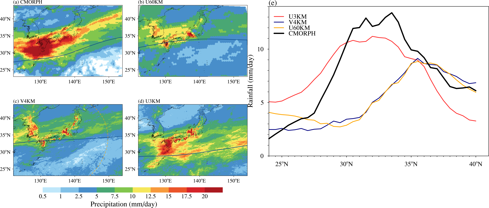
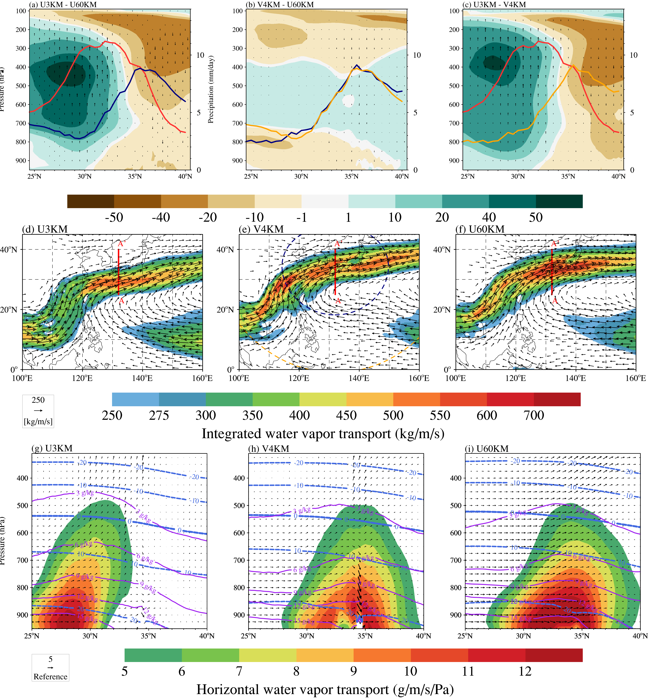
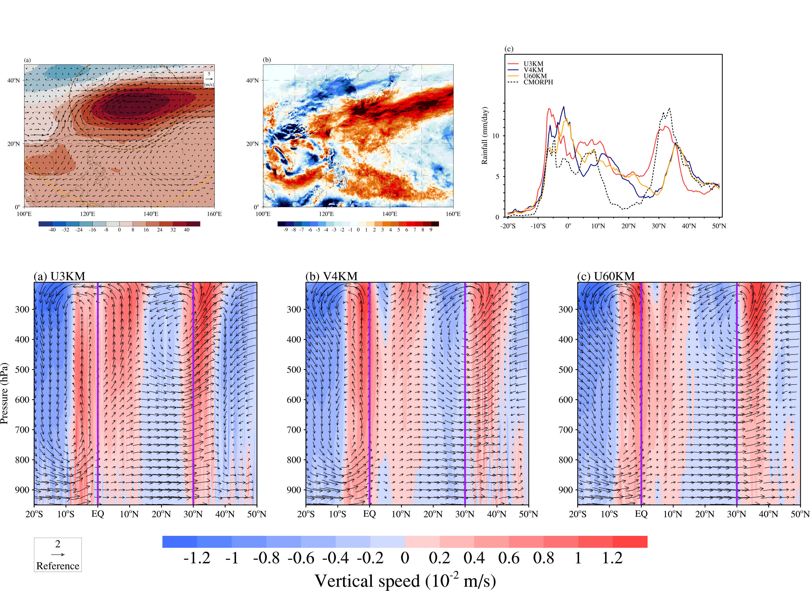
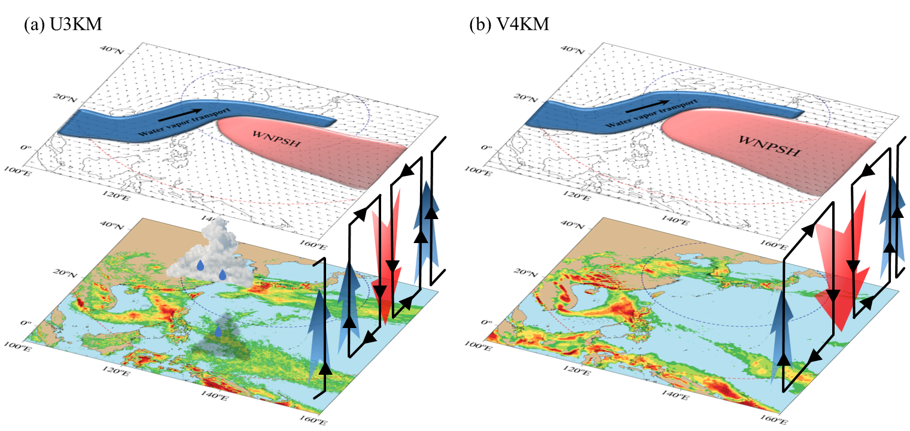

# The code for Japan Rainfall using iAMAS

> [!NOTE]  
> Due to the large size of the NetCDF format file for analysis, it is impractical to upload directly. Instead, I have created a compressed version of the file, which is now accessible in the cloud. Upon publication, this repository will remain unchanged and will be deposited into a FAIR-compliant repository.

## Figure1

## Figure2

## Figure3

## Figure4

## Supporting Information
To be continued
